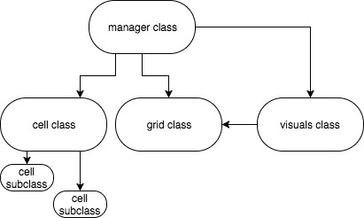
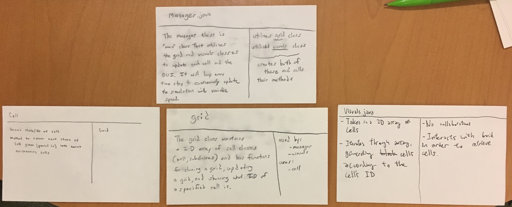

Cell Society Group 18 DESIGN
====
by Marcus Oertle, Brandon Guo, Yashas Manjunatha

## Questions

1. How does a Cell know what rules to apply for its simulation?
	- The rules that apply for each subclass (ie. cell types) are stored within that subclass. The abstract superclass has the abstract undefined method "rules()".
2. How does a Cell know about its neighbors? How can it update itself without effecting its neighbors update?
	- A cell will be passed its neighbors and based on them, decide what it needs to update to in "update()" and return to the manager class. 
	- The manager will have two 2-D array, one that is the current state and another that it will update the current state to at the end of the round. This second array will be updated as each cell returns its updated type. This way the cell doesn't need to change itself and thus doesn't need to worry about inadvertently affecting it's neighbors.
3. What is the grid? Does it have any behaviors? Who needs to know about it?
	- The grid is a class that contains a 2-D array of cell objects. 
	- If the grid is passed another grid, it will duplicate that grid's parameters. This will be useful for making a duplicate of the current simulation state for updating it.
	- The grid has a function called "update" that can be passed the row and column of the grid to update. 
	- The manager class utilizes the grid class to store cells and update cells during each time step. 
	- The visuals class (that is responsible for graphics) will also be passed a grid to spawn in the graphics for the project.
4. What information about a simulation needs to be the configuration file?
	- name of simulations
	- settings for global configs
	- dimensions of grid
	- initial state of grid
5. How is the GUI updated after all the cells have been updated?
	- The visuals class can be passed a grid and update the GUI. So after the manager class creates a new grid object and updates it with its update function, that grid can be passed to the visuals class to update the GUI.



## CRC Cards


## Use cases
1. Apply the rules to a middle cell: set the next state of a cell to dead by counting its number of neighbors using the Game of Life rules for a cell in the middle (i.e., with all its neighbors)

```java
// within manager class:
Grid new_Grid = Grid(current_Grid);
new_Grid.update(current_Grid);

// within grid class:
// for each cell in 2-D arrayList:
new_id = cell.update(neighbour info) //returns new state of cell
```

2. Apply the rules to an edge cell: set the next state of a cell to live by counting its number of neighbors using the Game of Life rules for a cell on the edge (i.e., with some of its neighbors missing)

```java
// within manager class:
Grid new_Grid = Grid(current_Grid);
new_Grid.update(current_Grid);

// within grid class:
// for each cell in 2-D arrayList:
new_id = cell.update(neighbour info) //returns new state of cell
```
3. Move to the next generation: update all cells in a simulation from their current state to their next state and display the result graphically

```java
current_Grid = new_Grid;
Visuals.display(current_Grid);
```

4. Set a simulation parameter: set the value of a parameter, probCatch, for a simulation, Fire, based on the value given in an XML fire

```java
// in manager class
parseFile(fileName); // updates parameters as it reads them
```

5. Switch simulations: use the GUI to change the current simulation from Game of Life to Wator

```java
parseFile(fileName); // updates parameters as it reads them
Grid current_Grid = new Grid(parameters from parse file);
Visuals.display(current_Grid);
```