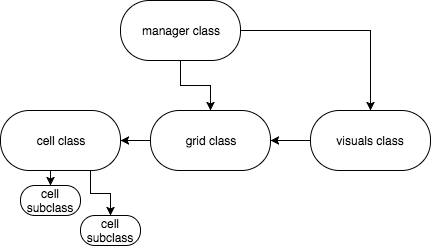
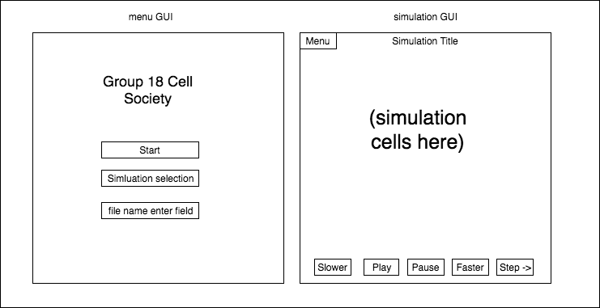

CompSci 308: Cell Society Design Plan
===================

> This is the link to the assignment: [Cell Society](https://www2.cs.duke.edu/courses/compsci308/current/assign/02_cellsociety/index.php)

### Introduction

Objective: Our project goal is to write a Java program using JavaFX that animates any 2D grid CA simulation.

Design Goals: 
* Able to take in user input files
* Able to step-by-step simulate the cell interactions
* Able to simulate a variety of simulations
* Able to handle the same simulation with different intial states and parameters
* Able to graphically visualize the simulations
* Able to relatively easily add new simulations

Architecture of Design:
* Simulation and grid will be open
* Cell will be closed

### Overview
* Cell (Abstract)
 > - Defines properties of a Cell, most importantly state
 > - Has abstract method called NextState, which takes in it's neighbors as parameters and returns the cell's next state

* Sub_Cell (Subclass of Cell)
 > - Implements NextState, which contains the rules and specific interactions between a cell and it's neighbors. Every cell type has a unique implementation of this method

* Grid
 > - Takes in a "current" 2D array of cells, and returns a "next" 2D array of cells. 
 > - Iterates across the 2D array, calling "NextState" of each cell and adding a cell with the return value of NextState to the "next" 2D array
 > - Has method that returns the "next" 2D array of cells.

* Simulation
 > - Manages the simulation. Allows for input file, runs simulation, and handles presenting next frame.

* Visualizer
 > - Creates the graphical presentation of the simulation
 > - Adds and represents all objects on screen



### User Interface
* Main menu:
 > - Start button
 > - Simulation type selection from drop down list
 > - Text field option to load user's custom XML file
 > - "File not found" displayed if file is not found after pressing start
* During simulation:
 > - Play button (resumes the simulation)
 > - Pause button (pauses the simulation)
 > - Speed up button (increase simulation speeed)
 > - Slow down button (decrease simulation speed)
 > - Step forward button (move the simulation forward in small steps)
 > - Menu button (return to menu so another simulation can be loaded)



* Errors Reported to User
 > - Input data file not found
 > - Data file not formatted correctly

### Design Details 

* Cell (Abstract)
> - A cell will be passed its neighbors and based on them, decide what it needs to update to in "update()" and return to the grid class. 
> - The manager will have two grids, one that is the current state and another that it will update the current state to at the end of the round. This second grid will be updated as each cell returns its updated type. This way the cell doesn't need to change itself and thus doesn't need to worry about inadvertently affecting it's neighbors.

* Sub_Cell (Subclass of Cell)
> - This subclass of cell will include the simulation specific parameters and rules for the cell's transition to another cell
> - It will use information from the XML file that specifices the simulation parameters
> - It will collaborate with the grid class because the grid will be a 2D array of cell objects, and will collaborate with the visualization class to specify how the different cell objects should be visualized
> Since this is a subclass of the abstract super class cell, creating new subclasses of cell will make our program flexible and able to extend to new types of cells

* Grid
> - The grid is a class that contains a 2-D array of cell objects. 
> - If the grid is passed another grid as the only parameter, it will duplicate that grid's parameters. This will be useful for making a duplicate of the current simulation state for updating it (this way we don't accidentally modify the current state and mess up future decisions in the same step).
> - The grid has a function called "update" that can be passed the index of the grid to update. It will use the cell class's "update" function to figure out what to change about the specified location.
> - The manager class utilizes the grid class to store cells and update cells during each time step. 
> - The visuals class (that is responsible for graphics) will also be passed a grid to spawn in the graphics for the project. It will parse through the grid and display the visuals based on that. The grid will have a function .getVisuals that will iterate through the cells and make a new ArrayList of all their visual parameters to pass back to the visuals class.

* Simulation (manager)
> - The manager is responsible for running the simulation/program.
> - It handles the creation and storage of the current grid and modified grid.
> - It contains the step function that will run at the FPS of the simulation.
> - Will contain a read function for reading the XML file and will pass the read data to the grid class to create a new grid for the simulation.

* Visualizer
> - Based on the grid passed to it, the visualizer class will update all visuals of the cells in the simulation to match that of the current grid's cells.
> - Removes "old" grid images, iterates through the 2D array and adds each new cell to the "new" grid images, then visualizes the new grid. 
> Can call .getVisuals on the grid (which will call .getColor, etc for each cell) that was passed to it and the grid class will return an 2-D ArrayList of all the colors/images required for displaying each cell.

#### Use Cases
* Apply the rules to a middle cell: set the next state of a cell to dead by counting its number of neighbors using the Game of Life rules for a cell in the middle (i.e., with all its neighbors)
```java
// within manager class:
Grid new_Grid = Grid(current_Grid);
new_Grid.update(current_Grid);

// within grid class:
// for each cell in 2-D arrayList:
new_id = cell.update(neighbour info) //returns new state of cell
```
* Apply the rules to an edge cell: set the next state of a cell to live by counting its number of neighbors using the Game of Life rules for a cell on the edge (i.e., with some of its neighbors missing)
```java
// within manager class:
Grid new_Grid = Grid(current_Grid);
new_Grid.update(current_Grid);

// within grid class:
// for each cell in 2-D arrayList:
new_id = cell.update(neighbour info) //returns new state of cell
```
* Move to the next generation: update all cells in a simulation from their current state to their next state and display the result graphically
```java
current_Grid = new_Grid;
Visuals.display(current_Grid);
```
* Set a simulation parameter: set the value of a parameter, probCatch, for a simulation, Fire, based on the value given in an XML fire
```java
// in manager class
parseFile(fileName); // updates parameters as it reads them
```
* Switch simulations: use the GUI to change the current simulation from Game of Life to Wator
```java
parseFile(fileName); // updates parameters as it reads them
Grid current_Grid = new Grid(parameters from parse file);
Visuals.display(current_Grid);
```

### Design Considerations
1. Using an abstract Cell class
    * Pros: Easy to add new subclasses, Simulation class calls the same method name for every subclass
    * Cons: Lots of subclasses 

2. Using a 2D Array to store cell neighbors
    * Pros: Easy, intuitive location of surrounding/adjacent cells, simple visualization
    * Cons: Not immediately adaptable to non-square layouts, requires knowing input matrix size beforehand to initialize.

3. Having a separate class handle visualizations
    * Pros: Easy debugging, Separations between GUI and backend
    * Cons: Rigidity with applicable usecases (very specific visualizations)


### Team Responsibilities
* Front end 
 > - Manager class
 > - Graphics (visuals class)
 > - *Roles*:
     * Primary: Brandon Guo
     * Secondary: Yashas Manjunatha
* Back end
 > - Grid class
 > - Cell class
 > - *Roles*:
        * Primary: Yashas Manjunatha
        * Secondary: Marcus Oertle
* XML
 > - Generates all required XML files
 > - Ensures integration with XML files
 > - After completion, helps both front end and back end with anything they need
 > - Ensures integration of front with back end
 > - *Roles*:
        * Primary: Marcus Oertle
        * Secondary: Brandon Guo

*Note*: Primary is the one responsible for seeing the section through to completion, secondary is the "checks and balances" to ensure that it is getting done or to offer assistance on the section when required.